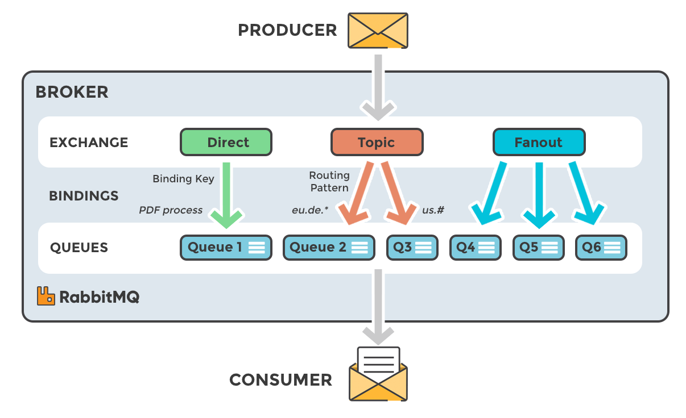

# RabbitMQ

## 专用名词解析

**AMQP (Advanced Message Queuing Protocol)**: 一种二进制消息协议，由摩根大通于2003年推出，是 RabbitMQ 默认使用的消息协议。

**Broker (消息处理中心)**: 负责消息存储、确认、重试等，一般其中会包含多个 Queue。

**Producer (消息生产者)**: 负责产生和发送消息到 Broker。

**Consumer (消息消费者)**: 负责从 Broker 中获取消息，并进行相应处理。

**Queue (消息队列)**: 存放消息的地方，存储在服务器的内存或者硬盘。

**Exchange (交换机)**: 生产者推送的消息不是直接写到队列，而是先经过交换机，由交换机按照路由规则将消息路由到一个或者多个队列；如果路由不到，或者返回给生产者，或者直接丢弃。

**RoutingKey (路由键)**: 生产者将消息发送给交换机的时候，会发送一个 RoutingKey，用来指定路由规则，这样交换机就知道把消息发送到哪个队列。

**Binding (绑定)**: 交换机和消息队列之间的虚拟连接，绑定中可以包含一个或者多个 RoutingKey。

**Virtual Host (虚拟主机)**: 每个 Virtual Host 相当于一个相对独立的 RabbitMQ 服务器；每个 Virtual Host 之间是相互隔离的，Exchange、Queue 和消息不能互通。可以将 RabbitMQ 理解为一个数据库，而 Virtual Host 就是其中的一个库。

**Channel (信道)**: 客户端连接上 RabbitMQ 服务器后，需要先创建信道，通过信道来声明队列①，然后再进行消息的发送或接收。消息读写等操作在信道中进行，客户端可以建立多个信道，每个信道代表一个会话任务。

*注①： 声明队列是幂等的，若队列不存在则会自动创建，若已存在则返回原有队列。*

## 常用的交换机类型

### direct (完全匹配)
The message is routed to the queues whose binding key exactly matches the routing key of the message.

发送消息时需要指定 routing key，会将消息根据 routing key 路由到完全匹配的队列。

### fanout (广播模式)
A fanout exchange routes messages to all of the queues bound to it.

忽略 routing key，消息会被发送到与交换机绑定的所有队列中。

### topic (模糊匹配)
The topic exchange does a wildcard match between the routing key and the routing pattern specified in the binding.

支持模糊匹配的 routing key。

- `#`: 代表匹配 0 ~ n 个，支持多级。比如 routing key 是 `#.emai`，那么 `email` 和 `a.b.email` 都可以命中。
- `*`: 代表必须匹配一个，且只能是一级。比如 routing key 是 `*.sms.*`，那么 `a.sms.b` 可以命中，但是 `a.sms`，`sms.b` 和 `a.b.sms.c` 都不能命中。

### headers (头属性匹配)
Headers exchanges use the message header attributes for routing.

根据消息的 headers 来投递消息而不是根据 routing key 来投递消息，在绑定队列时需要指定参数 Arguments，发送消息时只有指定的 headers 与队列绑定时对应的 Arguments 相匹配时，消息才会被正确投递。

举个例子，假设 queue1 的 Arguments 是 `x=1`，queue2 的 Arguments 是 `y=1`，那么发送消息的时候指定 header 为 `x=1`，则只有 queue1 能收到；指定多个 header，比如 `x=1, y=1`，那么 queue1 和 queue2 都能收到消息。

## 常见问题

**Q: 为什么发送消息失败？**

A: 一般是因为磁盘空间不足，默认至少需要有 200MB 可用磁盘空间。
